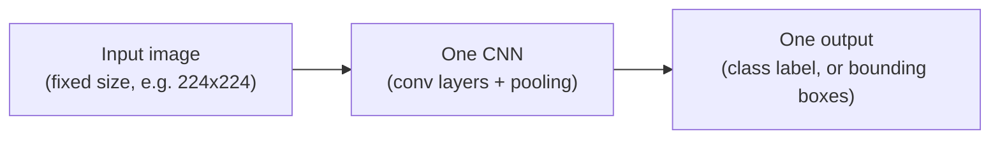
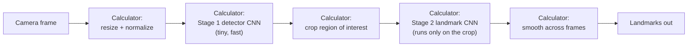

# What Is MediaPipe? And How Is It Different From "Regular" CNNs?

**By Gita — SEED ML**
*A quick primer for students coming from a classic CNN / image-classification background, before starting the MediaPipe lesson series.*

---

## 1. What You Already Know (the CNN mental model)

If you've trained a CNN before, your mental model of "computer vision" probably looks like this:

One image goes in, one model runs, one prediction comes out. If you wanted **multiple things at once** — say, a face's location *and* its landmarks *and* its expression — you'd typically either train one large multi-task network, or run several separate models back-to-back yourself, wiring the glue code by hand (crop here, resize there, feed into the next model...).

That mental model is correct — and it's also exactly what MediaPipe is doing *under the hood*. The difference is that MediaPipe formalizes that glue code into a reusable system, so you never have to write it yourself.

## 2. What MediaPipe Actually Is

**MediaPipe is not a new kind of neural network.** It's a **pipeline framework** — Google's system for chaining together small, fast, purpose-built CNNs (plus the pre/post-processing steps between them) into a single reusable unit called a **Task**. Internally, MediaPipe represents the whole pipeline as a **graph**: a sequence of small processing nodes called **Calculators**, each one doing one job (resize a frame, run a model, crop a region, smooth a value across frames) and passing its output to the next node.

When you call `detector.detect_for_video(...)` in the code from Docs 1 & 2, you are not calling "a CNN." You're triggering this **entire graph** — several small models and processing steps chained together — and getting back the final, cleaned-up result.

## 3. The Big Structural Difference: One Big Model vs. Two Small Ones in Sequence

This is the single most important thing to internalize, and it's true across almost every MediaPipe vision task (Hand Landmarker, Face Landmarker, Pose Landmarker):

| | **Classic single-CNN approach** | **MediaPipe's approach** |
|---|---|---|
| **Structure** | One model, trained end-to-end, sees the whole image | **Two-stage**: a tiny **detector** model finds a rough region of interest (ROI), then a separate **landmark/regressor** model runs *only on that cropped region* |
| **Example** | A ResNet classifying "is there a hand in this image" | Stage 1: **BlazePalm** finds a rough palm box in the full frame. Stage 2: the **Hand Landmark** model runs on just that cropped, aligned palm patch to output 21 precise points |
| **Why split it up?** | N/A | The full frame is big and mostly irrelevant background; a small model looking at a small, zoomed-in, already-aligned crop can be both **faster** and **more accurate** than one big model looking at everything at once |
| **Across frames** | Every frame processed independently, from scratch | Stage 1 (the expensive full-frame search) is often **skipped after the first frame** — MediaPipe derives the next region of interest directly from the *previous frame's* landmarks, and only re-runs full detection if tracking is lost |

This detector→crop→regress pattern is exactly why MediaPipe's models are named the way they are: **BlazeFace** and **BlazePalm** are the fast, lightweight *detectors*; the *landmark/mesh* models are separate, purpose-built regressor CNNs that only ever look at a small, cropped, pre-aligned patch. **Both stages are still CNNs** — you haven't left the world you know — they're just smaller, more specialized, and chained together instead of being one monolithic network.

## 4. Other Practical Differences From "Do It Yourself With a CNN"

**You don't train these models (usually).** In a typical CNN course project, you build and train your own network on your own labeled dataset. MediaPipe's Hand/Face/Pose/Object models are **pre-trained by Google** and shipped as ready-to-use `.task`/`.tflite` files — you *use* them, the same way you'd use a pretrained ImageNet backbone, except MediaPipe also wraps all the pre/post-processing for you. (You *can* still fine-tune the classification "head" of some tasks — like custom gestures or custom object categories — using the separate **Model Maker** tool, which is transfer learning on top of these pretrained backbones, not training from scratch.)

**Coordinates are normalized and tracked across time, not just predicted per-frame.** A plain CNN classification/detection model just gives you an output tensor for the current input. MediaPipe's landmark tasks return **normalized `[0,1]` coordinates** (resolution-independent) *and* apply temporal smoothing/tracking logic between frames (the "derive next ROI from last frame" trick above), so a live video feed looks stable instead of jittering detection-to-detection the way independent per-frame CNN inference often does.

**It runs in real time on a CPU, by design.** Classic large CNNs (ResNet-50, VGG, etc.) are usually assumed to run on a GPU, especially for real-time video. MediaPipe's component models (BlazeFace, BlazePalm, BlazePose) are deliberately tiny — designed to hit tens of milliseconds per stage on a phone or laptop CPU — which is *why* the two-stage detector-then-crop trick matters so much: a small model on a small cropped image is cheap enough to run every frame without a GPU.

**You configure behavior instead of writing forward-pass code.** Instead of writing `model(input_tensor)` and manually handling outputs, you configure an `Options` object (`num_hands=2`, `min_tracking_confidence=0.5`, etc.) and call `.detect()` — the framework handles resizing, normalization, cropping, running each stage, and formatting the result into a clean Python object (`result.hand_landmarks`, etc.).

## 5. One-Sentence Summary

> **A CNN is one model that maps pixels to a prediction. MediaPipe is a pipeline of several small, pre-trained CNNs — a fast detector followed by a focused regressor, with tracking logic between frames — packaged behind one simple `.detect()` call, so you get accurate, real-time, multi-stage vision without writing the plumbing yourself.**

Once this clicks, everything in Docs 1 and 2 becomes much less mysterious: every `HandLandmarker`, `FaceLandmarker`, and `PoseLandmarker` call you write is just triggering a small graph of CNNs you didn't have to build, running on a crop you didn't have to compute, giving you coordinates you don't have to smooth by hand.

---

*Read this before Document 1 if terms like "landmark," "BaseOptions," or "running mode" feel unfamiliar coming from a classification/detection CNN background — this primer explains the "why" behind that vocabulary.*
